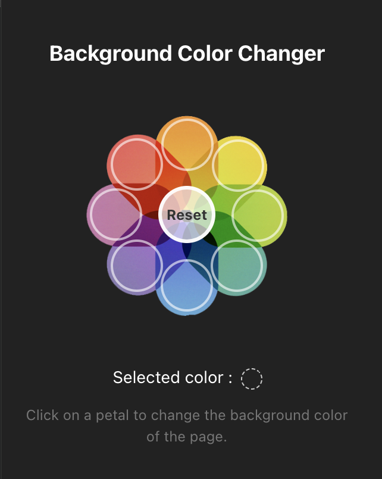

[](https://www.npmjs.com/package/addon-background-color-wxt)
[](https://nodejs.org/)
[](https://wxt.dev/)
[](https://www.typescriptlang.org/)
[](https://react.dev/)

# Addon Background Changer

This repository contains a small browser extension (built with wxt + React) that demonstrates changing the page background color from a popup.

## Aperçu

<p align="center">
  
</p>


## Quick install

Requirements
- Node.js (LTS recommended)
- npm (comes with Node.js)

Install dependencies:

```bash
# from the project directory
npm install
```

> Note: the project runs `wxt prepare` automatically after install via the `postinstall` script.

## Local development

Run the development server with hot reload for the browser:

```bash
npm run dev
```

- To run specifically with Firefox during development:

```bash
npm run dev:firefox
```

`npm run dev` will start the wxt dev flow. For Chromium-based browsers you can open the extension UI in the browser that wxt launches, or load the unpacked extension from the output folder (see next section).

## Build

Build a production bundle:

```bash
npm run build
```

This produces the built extension in `.output/extension` by default.

## Create distributable ZIP / package

- Create a ZIP suitable for uploading to the Chrome Web Store (or for manual distribution):

```bash
npm run zip
```

- Build a packaged artifact for Firefox (uses web-ext to produce an XPI under `dist-artifacts`):

```bash
npm run pack:zip
```

## Load the extension locally (Chrome / Edge)

1. Build the project: `npm run build`
2. Open Chrome and visit `chrome://extensions`
3. Enable "Developer mode" (top-right)
4. Click "Load unpacked" and choose the `.output/extension` folder from the project root

The extension will appear in the toolbar. Click its icon to open the popup and use the UI to change the page background color.

## Debugging in Firefox

You can run `npm run dev:firefox` to launch a Firefox instance with the extension loaded for development. To load a built extension in Firefox manually, use `npm run pack:zip` then upload or load the produced XPI from `dist-artifacts`.

## Usage

1. Open any webpage.
2. Click the extension icon in the browser toolbar.
3. Use the popup controls to pick or apply a new background color. The content script will change the page background accordingly.

## Deploy / Publish

- Chrome Web Store: build and zip (`npm run zip`) and follow the Chrome Web Store developer dashboard to upload the ZIP and publish.
- Mozilla Add-ons (AMO): use `npm run pack:zip` to create an XPI and follow the Mozilla Add-ons site to submit and publish.

Each store requires a developer account and metadata (screenshots, description, policy compliance). Follow their submission guides for signing and review.

## Troubleshooting

- If `npm run dev` or `npm run build` fails, ensure Node.js and npm are installed and up-to-date. Consult the terminal output for specific errors.
- If the extension doesn't appear after loading the unpacked folder, make sure you selected the `.output/extension` directory created by `npm run build`.

## Useful scripts

- `npm run dev` — start development server (wxt dev)
- `npm run dev:firefox` — run dev session using Firefox
- `npm run build` — build production extension into `.output/extension`
- `npm run zip` — create a ZIP distributable
- `npm run pack:zip` — build and create artifacts for Firefox (via web-ext)
- `npm run compile` — type-check the TypeScript without emitting files

